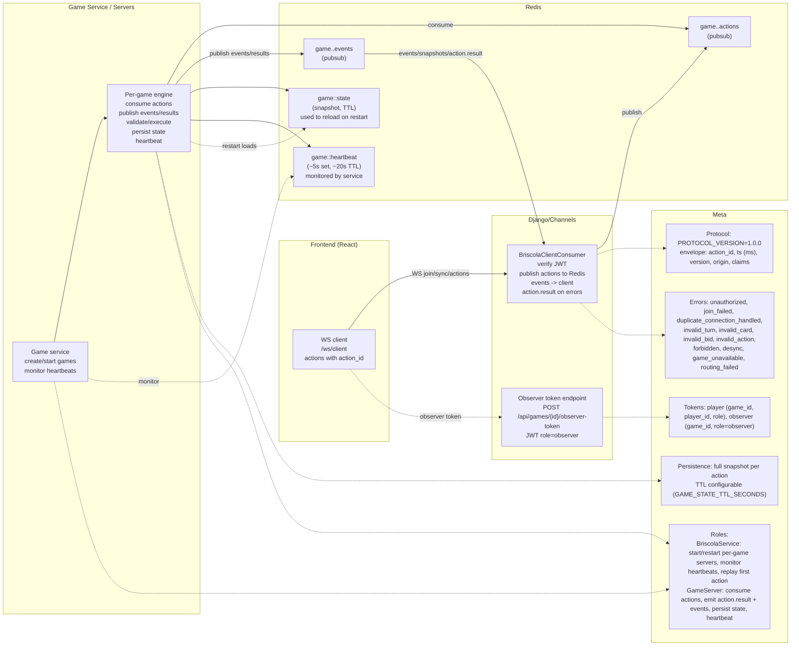

# PyBriscola Architecture (Draft)

## Mermaid Diagram

## Component Responsibilities (as shown in the diagram)
- **Frontend (React)**: Maintains a WebSocket to `/ws/client/`, sends actions with `action_id`, receives `action.result`, events, and snapshots; uses observer/player tokens to join.
- **Web (Django/Channels)**: Verifies JWTs (player/observer), publishes client actions to Redis `game.<id>.actions`, subscribes to `game.<id>.events`, forwards events/action.results to clients, and issues observer tokens via HTTP endpoint.
- **Redis**: Transports actions/events via pubsub (`game.<id>.actions` / `game.<id>.events`) and stores state snapshots (`game:<id>:state`, TTL) and heartbeats (`game:<id>:heartbeat`, ~5s set, ~20s TTL, monitored).
- **Game Service**: Creates/starts per-game servers, monitors heartbeat keys, restarts servers if heartbeats expire, and replays the first action if needed when a server starts.
- **Per-game GameServer**: Subscribes to `game.<id>.actions`, validates/executes actions (bid, call-rank/suit, play, reorder, sync), emits `action.result` + events to `game.<id>.events`, persists snapshots to Redis, writes heartbeats, and reloads state from snapshots on restart.
- **Meta**: Protocol (PROTOCOL_VERSION, envelope fields), persistence (snapshot TTL), error codes (e.g., unauthorized, invalid_action, desync), token roles (player/observer), roles (service vs per-game server).
